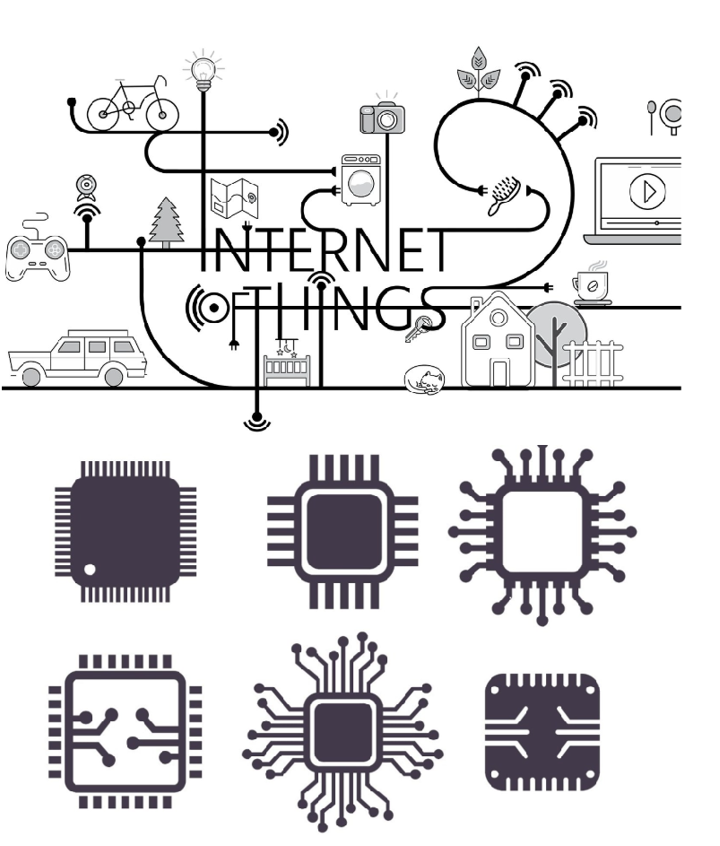

### Hi there 👋, Hello im Jeffin
#### Im a R&D embedded engineer

Research And Development Engineer who skilled in Embedded C,C,C++ and Low level driver development.

# Skills & Endorsements

* Microcontrollers
* Electronics
* Cloud Computing
* Internet Protocol Suite (TCP/IP)
* ESP8266
* Arduino
* Azure IoT,AWS IoT,IBM Watson
* EasyEDA
* MQTT,HTTP,AES,HTTPS,Arduino JSON
* C , C++ , Embedded C

Works in Research and Development (R&D), Internet of Things, AWS , AWS IoT , AWS API Gateway , AWS Lambda , ESP8266 and ARM cortex,PCB design (Familiar with EDA tools) and interfacing with sensors using USB, I2C, SPI, GPIO,UART and experience in IDEs like Kiel & Arduino.

Experimented Azure IoT hub and IBM WATSON cloud console publish and subscribe methods.

Skills: AWS / AZURE /ESP8266 / ARDUINO / C / C++ / CLOUD COMPUTING / WIFI PROTOCOLS

- 🔭 I’m currently working on ...Embedded & cloud computing  
- 🌱 I’m currently learning ...Azure | Aws | Ibm | Cloud computing 
- 👯 I’m looking to collaborate on ... anyone😄  
- 🤔 I’m looking for help with azure_pubsub_ESP8266 with AWS..more clearly listening on multiple port!!😤 
- 💬 Ask me about on my domain 
- 📫 How to reach me: [My linkedin](http://linkedin.com/in/jeffin-mathew-28j) 
- 😄 Pronouns: jeff/jeffin 😎 
- ⚡ Fun fact: Still learning😜 

      

  

  

  

  
